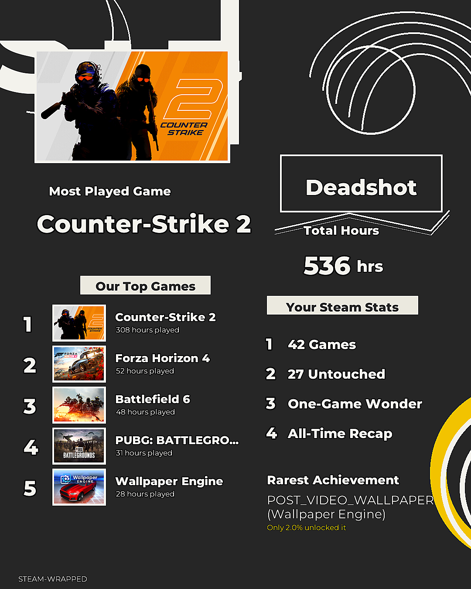

# Steam Wrapped

A "Spotify Wrapped" style recap card generator for your Steam library — total hours played, top games, backlog size, rarest achievement, and a fun badge based on your play patterns. Built with the Steam Web API and Pillow.



## Features

- Total hours played across your whole library
- Top 5 most-played games with a bar chart
- Backlog tracker — games you own but barely touched
- Longest single-game commitment
- Rarest achievement unlocked (compared against global unlock %)
- Genre breakdown (cached locally to respect Steam's rate limits)
- A rule-based "badge" summarizing your play style (e.g. *The Backlog Builder*, *The One-Game Wonder*)

## Setup

1. Clone this repo and create a virtual environment:
   ```bash
   git clone https://github.com/yourusername/steam-wrapped.git
   cd steam-wrapped
   python -m venv venv
   source venv/bin/activate   # Windows: venv\Scripts\activate
   pip install -r requirements.txt
   ```

2. Get a free Steam Web API key: https://steamcommunity.com/dev/apikey

3. Find your SteamID64 (use https://steamid.io/ if you only know your custom URL)

4. Make sure your Steam profile's **Game details** privacy setting is Public (Steam > Settings > Privacy Settings), or the API will return nothing

5. Copy `.env.example` to `.env` and fill in your values:
   ```
   STEAM_API_KEY=your_key_here
   STEAM_ID=your_steamid64_here
   ```

## Usage

```bash
python main.py
```

Your card will be saved to `output/wrapped_card.png`.

## Optional: better fonts

By default this uses Pillow's built-in font, which is functional but plain. For a nicer look, drop any `.ttf` font files into `fonts/` named `bold.ttf` and `regular.ttf` — the card generator will pick them up automatically.

## Project structure

```
steam-wrapped/
├── steam_api.py       # All Steam Web API calls
├── stats.py           # Turns raw API data into "Wrapped" stats
├── card_generator.py  # Renders the final PNG card with Pillow
├── main.py            # Entry point - wires everything together
├── fonts/             # Drop custom .ttf fonts here (optional)
└── output/            # Generated cards land here
```

## How it works

- `GetOwnedGames` pulls your full library with playtime
- `GetPlayerSummaries` pulls your display name and avatar
- `GetPlayerAchievements` + `GetGlobalAchievementPercentagesForApp` find your rarest unlocked achievement
- Genre tags come from Steam's store API, cached locally in `genre_cache.json` to avoid hitting rate limits on repeated runs

**Note:** Steam's API only exposes *all-time* playtime, not "this year's" playtime, unless you've been snapshotting your own data over time. So this is technically an "All-Time Wrapped" rather than a strict calendar-year one.

## License

MIT
